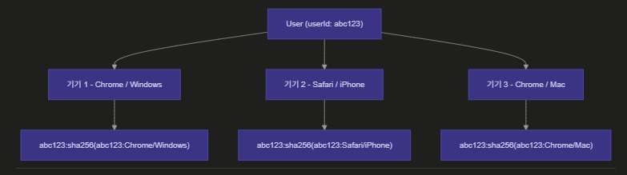

# 다중 기기 세션 관리

## 문제 상황

사용자가 기기에 관계없이 끊김 없이 서비스를 사용할 수 있어야 한다. PC에서 작업하다 모바일로 전환하거나, 여러 기기를 동시에 사용하는 상황은 일반적인 사용 패턴이다.

단일 세션 구조에서는 새 기기에서 로그인하면 기존 기기가 로그아웃되고, 특정 기기만 선택적으로 로그아웃하는 것도 불가능하다. 이는 사용자 편의성을 해치고 서비스 이탈로 이어진다. 다중 기기 세션을 지원하면 기기 전환 시 재로그인 없이 서비스를 이어서 사용할 수 있고, 서비스 입장에서는 세션 보안 제어 수단도 확보할 수 있다.

## 검토한 방법들

| 방법 | 문제 |
|---|---|
| UUID 랜덤 생성 | 같은 기기에서 재로그인 시 기존 세션이 남아 중복 세션 누적 |
| UA + IP 해시 | IP가 유동적(모바일 네트워크 전환, VPN 등)이라 같은 기기에서도 세션 키가 달라짐 |
| UA 해시 | 동일 기기/브라우저 재로그인 시 같은 키 생성 → 자동 갱신 |

IP는 세션 키에서 제외하되, 탈취 감지 목적으로 세션 데이터 안에 저장.

## 선택한 방향

```
sessionId = userId:sha256(userId:userAgent)
```

Redis 저장 구조:

```json
{
  "userId:sha256hash": {
    "userId": "uuid",
    "refreshToken": "token_string",
    "userAgent": "Mozilla/5.0...",
    "ip": "127.0.0.1",
    "createdAt": 1234567890
  }
}
```



UA를 기기 식별자로 쓴 이유: 별도 디바이스 등록 테이블 없이 다중 기기를 지원하는 가장 현실적인 방법. UUID는 중복 세션 문제, UA+IP는 IP 유동성 문제가 있어 제외.

## 결과

- 기기별 독립 세션으로 다중 기기 동시 로그인 가능
- 특정 기기 로그아웃 → 해당 키만 삭제
- 전체 로그아웃 → `userId:*` 패턴 SCAN 후 전체 삭제
- 동일 기기 재로그인 → 같은 키 덮어씀 → 세션 중복 없음

UA 변경(브라우저 업데이트 등) 시 기존 세션을 찾지 못해 재로그인이 필요한 한계는 있다.
