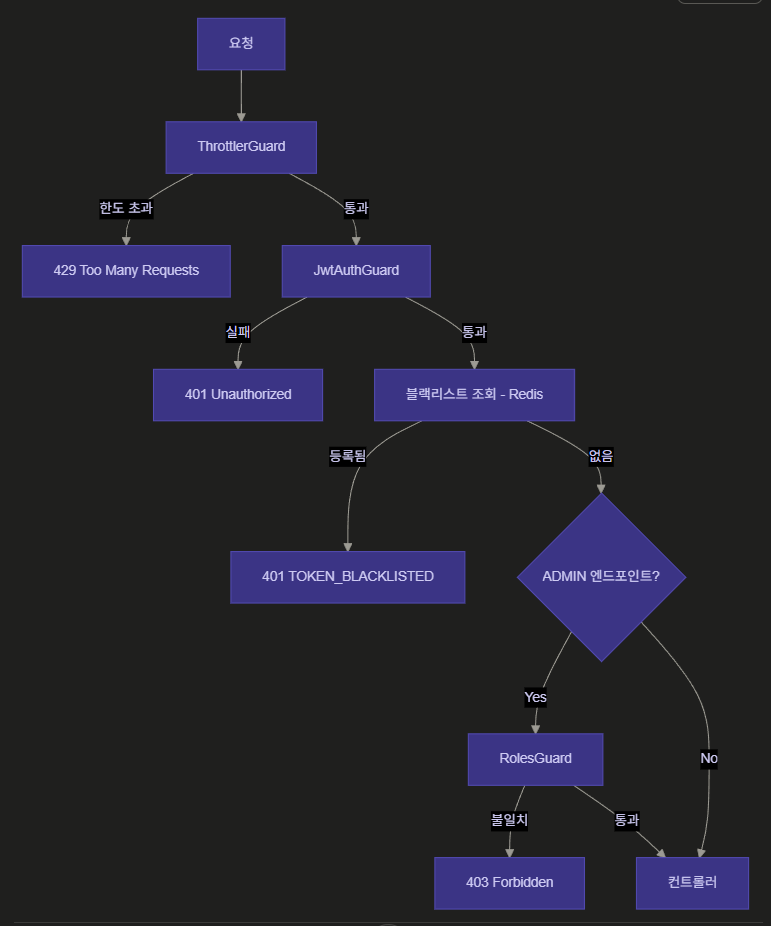

# 토큰 탈취 시나리오 대응

## 문제 상황

JWT 기반 인증은 stateless 특성상 서버가 발급 후 토큰을 취소할 수단이 없다. 토큰이 탈취되면 만료 전까지 공격자가 정상 사용자처럼 요청할 수 있다. 사용자가 로그아웃하거나 비밀번호를 바꿔도 이미 발급된 토큰은 유효하다.

이를 방치하면 계정 탈취 피해가 토큰 만료 시까지 지속되고, 사용자 신뢰를 잃는다. 단일 대응으로는 모든 시나리오를 막을 수 없어 시나리오별로 레이어를 중첩 적용하는 방식으로 접근했다.

---

## 시나리오별 검토 및 대응

### 1. CSRF (Cross-Site Request Forgery)

**시나리오**

refresh token이 쿠키에 저장돼 있어 악의적인 사이트에서 `POST /auth/refresh` 요청을 유도하면 브라우저가 자동으로 쿠키를 전송한다.

**대응**

쿠키에 `SameSite: lax` 설정. POST 요청은 외부 도메인에서 쿠키를 전송하지 않는다.

```typescript
res.cookie('refresh_token', token, {
  httpOnly: true,
  sameSite: 'lax',
  secure: isProdEnv(),
});
```

`strict`는 외부 도메인 GET 요청도 차단해 일부 정상 사용 패턴(외부 링크 클릭 후 로그인 유지 등)을 막을 수 있어 `lax`를 선택.

---

### 2. JWT 알고리즘 혼동 공격

**시나리오**

- `alg: none` 공격 — 알고리즘 없이 서명된 토큰을 서버가 수락
- RS256 → HS256 혼동 — 공개키를 HS256 secret으로 사용해 위조 토큰 생성

**대응**

토큰 발급 시 알고리즘 명시, 전략에서 허용 알고리즘 제한.

```typescript
// 발급
this.jwtService.signAsync(
  { jti: randomUUID(), sub: user.id, role: user.role },
  { algorithm: 'HS256' }
)

// 검증 (JwtStrategy, RefreshStrategy)
super({ algorithms: ['HS256'], ... })
```

`jti`(JWT ID)로 토큰마다 고유값을 부여해 동일 시간 발급 시에도 토큰 충돌을 방지.

---

### 3. Refresh Token 재사용 감지

**시나리오**

탈취된 refresh token으로 갱신 시도. 또는 탈취자와 정상 유저가 동시에 refresh 요청을 보낼 때, 먼저 갱신한 쪽이 새 토큰을 얻고 나중 요청은 불일치가 발생한다.

**검토한 방법들**

- 불일치 시 단순 401 반환 → 탈취 여부 구분 불가, 대응 없음
- 불일치 시 해당 세션 삭제 → 탈취자가 먼저 갱신하면 정상 유저의 다음 요청에서 감지 가능

**대응**

refresh 요청 시 저장된 토큰과 비교해 불일치하면 해당 세션 즉시 삭제.

```typescript
if (storedSession.refreshToken !== refreshToken) {
  this.logger.warn(`refresh token mismatch: ${user.id}`);
  throw new AppException(ErrorCode.SESSION_NOT_FOUND);
}
```

탈취자가 먼저 갱신하면 세션의 refreshToken이 새 토큰으로 갱신되고, 이후 정상 유저가 구 토큰으로 요청하면 불일치 → 세션 삭제 → 재로그인 필요. 정상 유저 입장에서는 불편하지만 탈취 상황에서 피해를 차단할 수 있다.

---

### 4. IP 불일치 감지

**시나리오**

탈취된 refresh token을 전혀 다른 환경(다른 IP)에서 사용.

**검토한 방법들**

- IP를 세션 키에 포함 → IP가 유동적이라 정상 사용자도 자주 세션이 깨짐 (기각)
- IP를 세션 데이터에 저장해 refresh 시 비교 → 불일치 시 삭제

**대응**

세션 생성 시 IP 저장, refresh 요청 시 비교. 불일치 시 세션 삭제 후 401.

```typescript
if (storedSession.ip !== userIp) {
  this.logger.warn(`IP mismatch detected, session deleted: ${user.id}`);
  await this.accountService.deleteSession(user, userAgent);
  throw new AppException(ErrorCode.IP_MISMATCH);
}
```

모바일 네트워크 전환이나 VPN 사용 시 오탐 가능성이 있다. access token 수명이 짧은 구조에서 감수 가능한 수준으로 판단.

---

### 5. Access Token 탈취 (블랙리스트)

**시나리오**

로그아웃 후에도 탈취된 access token이 만료 전까지 유효. stateless 특성상 서버가 발급 후 취소할 수단이 없다.

**검토한 방법들**

- access token 수명을 매우 짧게(1~5분) 유지 → 탈취 피해 시간 최소화. 완전한 즉시 무효화는 불가
- 블랙리스트 방식 → 로그아웃 시 즉시 무효화 가능. 매 요청마다 Redis 조회 추가

**대응**

두 방법 병행. 로그아웃 시 access token을 Redis 블랙리스트에 남은 TTL로 등록. `JwtAuthGuard`에서 서명 검증 후 블랙리스트 조회.

```typescript
// 로그아웃 시
const payload = this.jwtService.decode(token) as { exp: number };
const remainingTime = payload.exp * 1000 - Date.now();
await this.accountService.blacklistToken(token, remainingTime);

// JwtAuthGuard
if (token && (await this.accountService.isBlacklisted(token)))
  throw new AppException(ErrorCode.TOKEN_BLACKLISTED);
```

TTL이 지나면 Redis에서 자동 삭제 → 만료된 토큰은 어차피 서명 검증에서 거부되므로 저장 불필요.



---

### 6. 세션 고정 공격 (Session Fixation)

**시나리오**

공격자가 미리 만든 세션 ID를 피해자에게 사용하게 유도. 피해자가 로그인하면 공격자가 해당 세션으로 인증된 상태 획득.

**결론**

현재 구조에서 세션 ID가 `userId:sha256(userId:userAgent)` 해시로 생성돼 외부에서 미리 예측하거나 만들 수 없다. 별도 대응 불필요.

---

### 7. Race Condition (분산 환경)

**시나리오**

여러 서버가 동시에 같은 refresh token 요청을 처리. 두 서버가 모두 유효한 토큰으로 판단해 각각 새 토큰 발급 → 두 개의 유효한 세션 생성.

**현재 상태**

Redis `set`으로 단순 덮어쓰기 → race condition 가능. **미구현**.

**개선 방향**

Redis Lua 스크립트로 조회 + 교체를 atomic하게 처리. 기존 토큰 확인 후 새 토큰 저장을 단일 연산으로.

---

### 8. JWT 페이로드 정보 노출

**시나리오**

JWT payload는 암호화 없이 Base64 인코딩만 됨. 누구나 디코딩 가능 → 민감 정보 노출 위험.

**현재 상태**

payload에 `sub`(userId), `role`, `jti`만 포함. 이메일, 비밀번호 등 민감 정보 없음 → 별도 대응 불필요.

---

## 우선순위 기준 구현 현황

| 순위 | 시나리오 | 구현 여부 |
|---|---|---|
| 1 | CSRF (SameSite 설정) | ✅ |
| 2 | 알고리즘 혼동 | ✅ |
| 3 | Refresh Token 재사용 감지 | ✅ |
| 4 | IP 불일치 감지 | ✅ |
| 5 | Access Token 블랙리스트 | ✅ |
| 6 | 세션 고정 | ✅ (구조적으로 방어) |
| 7 | Race Condition | ❌ (미구현) |
| 8 | 페이로드 노출 | ✅ (민감 정보 미포함) |
